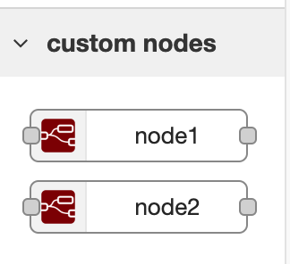

# Custom Node-red Node ES Template



## Directory Structure

```bash
node-red-node-es-template/
├── assets/
│   ├── icons/
│   │   └── icon.png
│   └── locales/
│       ├── de/
│       │   ├── index.hmtl
│       │   └── index.json
│       └── en-US/
│           ├── index.html
│           └── index.json
├── dist/
│   ├── icons/
│   │   └── icon.png
│   ├── locales/
│   │   ├── de/
│   │   │   ├── index.hmtl
│   │   │   └── index.json
│   │   └── en-US/
│   │       ├── index.html
│   │       └── index.json
│   ├── index.html
│   ├── index.js
│   └── index.js.map
├── src/
│   ├── nodes/
│   │   ├── node-1/
│   │   │   ├── index.js
│   │   │   └── index.html
│   │   └── node-2/
│   │       ├── index.js
│   │       └── index.html
│   └── index.js
├── package.json
└── package-lock.json
```
